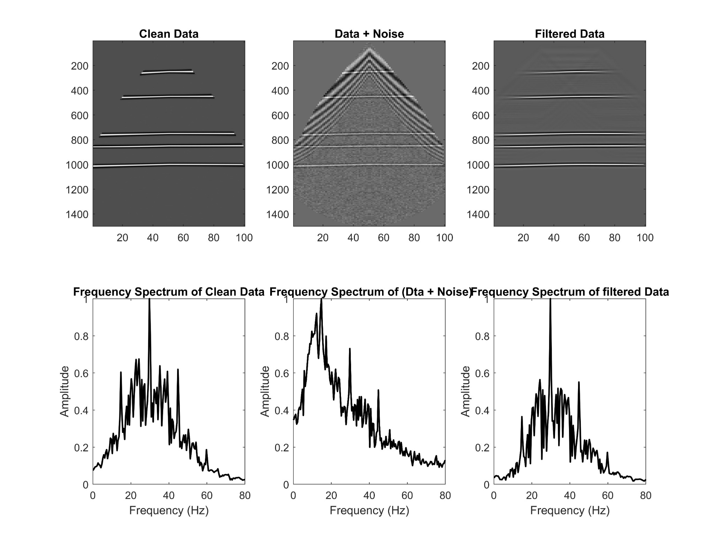
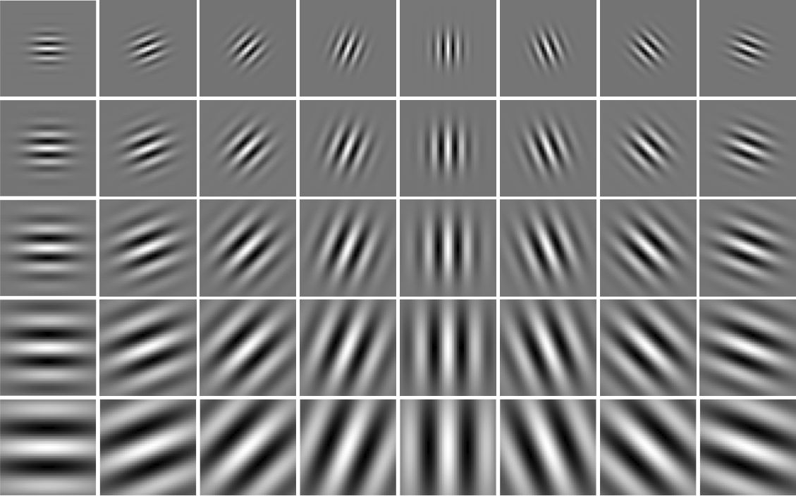
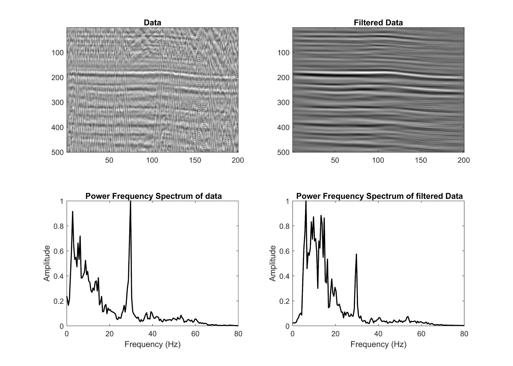

# Gabor seismic filter

A compact MATLAB implementation of an experimental workflow for emphasizing
selected orientations in 2-D seismic sections with a complex Gabor filter
bank. The repository preserves the supplied source, exposes the core method as
reusable functions, and includes a deterministic synthetic example because the
original seismic dataset was not supplied for redistribution.



## What this code implements

The supplied experiment builds complex 2-D Gabor filters at multiple scales
and orientations, applies every filter to a seismic section, sums responses
over scale, groups adjacent orientations, and adds two selected ranges of
orientation groups. The cleaned `filterSeismicSection` function preserves those
operations and the original default parameters: 10 scales, 180 orientations,
39-by-39 kernels, groups of five, selected groups 1-7 and 30-36, and a final
division by 10.

Gabor filters are Gaussian-windowed complex sinusoids. Their scale and
orientation select local spatial-frequency content, which makes the response
sum sensitive to seismic events with particular apparent dips. In this code,
the center frequencies decrease geometrically from 0.25 cycles/sample and the
orientations span `[0, pi)`.



This repository does **not** implement seismic inversion, migration, automatic
event classification, denoising parameter estimation, or the face-recognition
classification methods sometimes discussed alongside Gabor feature extraction.
It implements only the filter-bank construction, convolution, and selected
response aggregation visible in the supplied MATLAB scripts.

## Requirements

- MATLAB R2021a or newer
- Image Processing Toolbox, for `imfilter`

No installation step is required. Clone the repository and add `src` to the
MATLAB path:

```matlab
addpath('src')
```

## Usage

For the exact experimental defaults:

```matlab
load Data_Section.mat  % must define a 2-D array named data
filtered = filterSeismicSection(data);
imagesc(filtered); axis tight; colormap gray
```

The defaults construct 1,800 filters and retain all complex responses, so they
can require substantial time and memory. For exploratory work, pass a smaller
bank:

```matlab
filtered = filterSeismicSection(data, ...
    NumScales=5, NumOrientations=36, FilterSize=31, ...
    BinSize=3, SelectedBins=[1:3 10:12], Divisor=5);
```

Run the self-contained example from the repository root:

```matlab
run('examples/runSyntheticExample.m')
```

It generates a section with curved reflectors, coherent dipping noise, and a
fixed random seed. No research data are included.

## Tests

```matlab
runTests
```

The tests compare the cleaned filter bank element-by-element with the preserved
implementation, compare response aggregation with the original nested loops,
and check that the synthetic input is deterministic. The research-data result
cannot be reproduced because `Data_Section.mat` was not supplied.

## Results and limitations

The supplied synthetic figure shows that the chosen response sum can retain
near-horizontal events while attenuating much of the coherent dipping energy.
That result is illustrative, not a general benchmark. The selected orientation
ranges and divisor are hard-coded experimental choices rather than estimated
physical parameters, and summing complex responses may introduce cancellation.
Users should validate the settings against a suitable reference for each
survey. Boundary behavior follows `imfilter` with zero padding.

### Supplied real-world example

The following supplied figure shows the workflow applied to a real seismic
section. The left panel is the input section and the right panel is the summed
Gabor response. The processed view emphasizes laterally continuous events and
suppresses much of the short-wavelength directional texture present in the
input.



Only the result figure is published. The underlying field data were not
supplied for redistribution, so this example cannot be rerun from the
repository and should be treated as a qualitative illustration rather than a
quantitative validation.

The labels in the original script treated each five-filter group as five
degrees. With 180 filters spanning 180 degrees, each filter is one degree and
each group spans approximately five degrees; the cleaned API therefore calls
them bins and leaves their interpretation explicit.

## Repository structure

```text
src/       Clean reusable MATLAB functions
examples/  Reproducible synthetic data and demonstration
tests/     Numerical equivalence and determinism tests
original/  Untouched supplied sources retained for provenance
figures/   Selected supplied synthetic, filter-bank, and real-section figures
```

The paper PDF and unavailable research dataset are intentionally excluded.
Two unrelated demo files with no identified redistribution license are also
excluded; see `original/README.md`.

## Citation and license

Citation metadata are provided in `CITATION.cff`. The cleaned code is released
under the BSD 2-Clause License. Preserved third-party sources retain their
original attribution and license notice; see `THIRD_PARTY_NOTICES.md`.

The original filter-bank routines request citation of:

> M. Haghighat, S. Zonouz, and M. Abdel-Mottaleb, “CloudID: Trustworthy
> cloud-based and cross-enterprise biometric identification,” *Expert Systems
> with Applications*, 42(21), 7905-7916, 2015.
